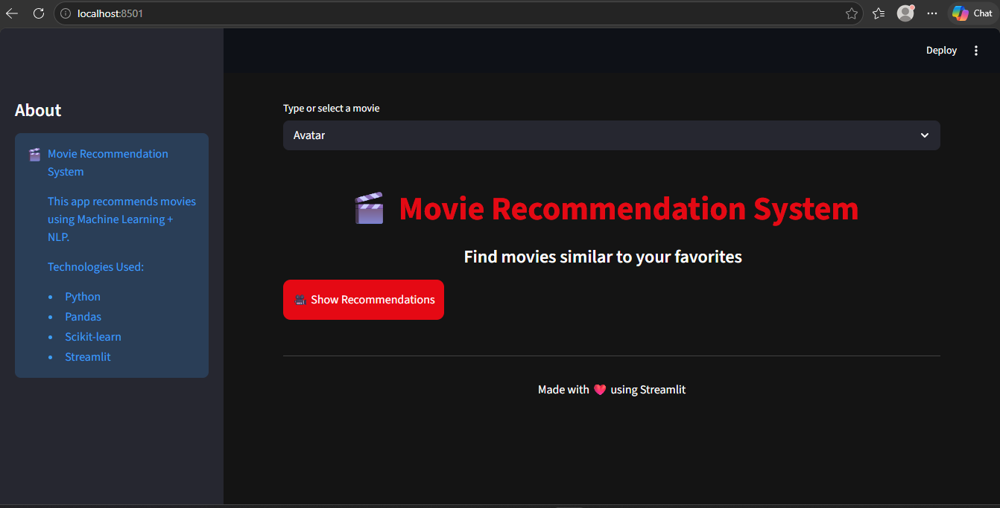
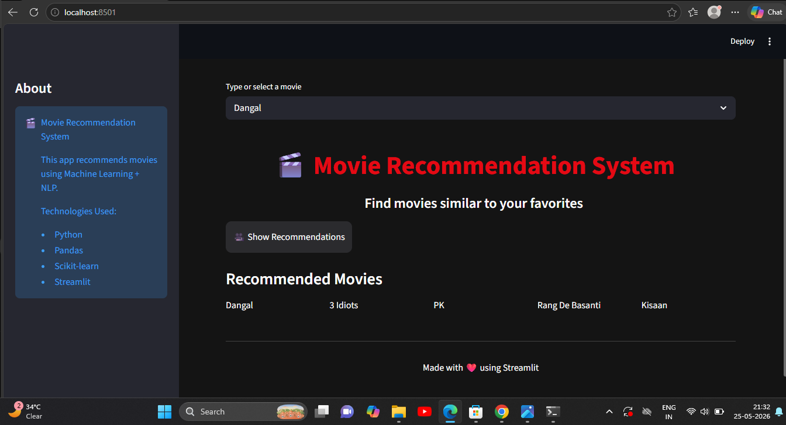

# 🎬 Movie Recommendation System

A machine learning-based movie recommendation system built using Python and Streamlit.  
It recommends movies similar to the selected movie using content-based filtering and NLP techniques.

---

## 🚀 Features

- 🎯 Recommend similar movies instantly
- 🎬 Works for Bollywood + Hollywood movies
- 🧠 Uses Machine Learning (Cosine Similarity)
- ⚡ Fast and interactive web app
- 📊 Simple and clean UI using Streamlit

---

## 🛠️ Tech Stack

- Python 🐍
- Pandas
- NumPy
- Scikit-learn
- Streamlit

---

## 📂 Project Structure

``` id="u4flcm"
Movie-Recommendation-System/
│
├── app.py
├── movie_recommender.ipynb
├── movies.pkl
├── similarity.pkl
├── data/
└── README.md
```

---

## ▶️ How to Run the Project

### 1️⃣ Install required libraries

```bash id="xg2hri"
pip install streamlit pandas scikit-learn
```

### 2️⃣ Run the Streamlit app

```bash id="wnvf7z"
streamlit run app.py
```

---

## 🧠 How It Works

- Movies are converted into feature vectors
- Similarity is calculated using Cosine Similarity
- Top 5 similar movies are recommended

---

## 🎯 Example

If you select:
- Avatar

You will get similar sci-fi / action movies recommended.

---

## 📸 Project Screenshots




---

## 👩‍💻 Author

Dipanshi

GitHub: https://github.com/itsdipanshi

---

## ⭐ Support

If you like this project, give it a ⭐ on GitHub!

---

## 📌 Note

This project is for learning and portfolio purposes.
